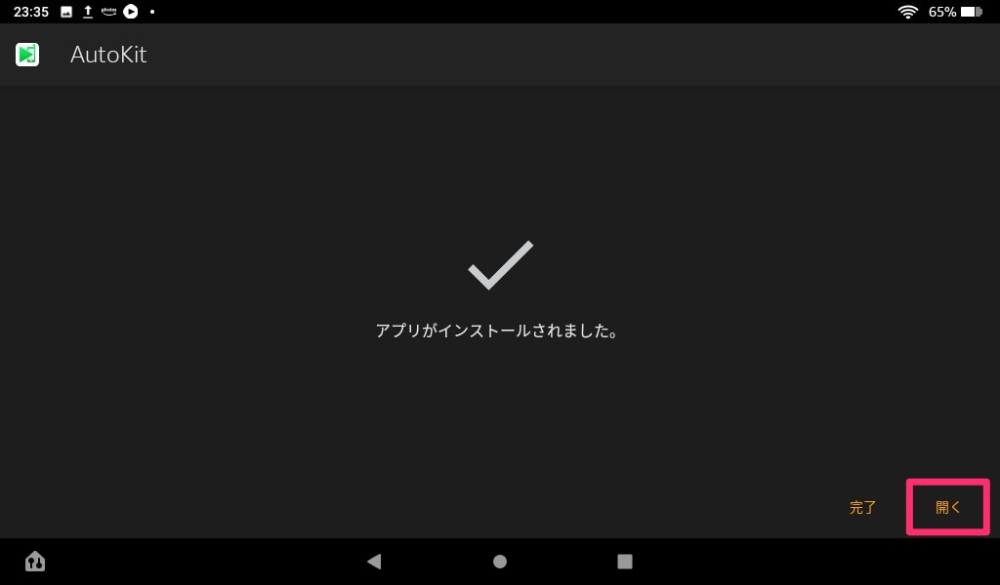

自分が自由に使っていい車ができてから、運転する機会が非常に増えました。今までは駅までの往復や、すでに知っている場所への運転ばかりでしたが、少し遠くの知らない場所へ行くためにはナビが必須です。

乗っている車にも古いナビがついているのですが、東京スカイツリーすら登録されていないような古いマップデータであったり、まず反応が悪くてiPhoneやiPadに慣れていると使う気になれません。そこで、今まではiPhoneでGoogleマップを使っていました。



## AutoKitのダウンロード・インストール

Fireタブレットに標準でインストールされている<b>Silkブラウザ</b>を使って、以下のURLを開き、apkファイルをダウンロードします。

[http://121.40.123.198:8080/autokit/autokit.apk](http://121.40.123.198:8080/autokit/autokit.apk)

ダウンロードした<b>autokit.apk</b>開きます。

Fireタブレットでは、基本的に**Amazonアプリストア**からしかアプリのインストールができない設定になっているので、これから<b>不明なアプリのインストール</b>を許可するように設定を変更していきます。

Silkブラウザからの<b>不明なアプリのインストール</b>を許可します。許可したら左上の矢印からインストール作業に戻ります。

AutoKitをインストールしていきます。

AutoKitを開くと、<b>ファイル,マイク,カメラへのアクセス許可</b>が求められると思うので許可します。

