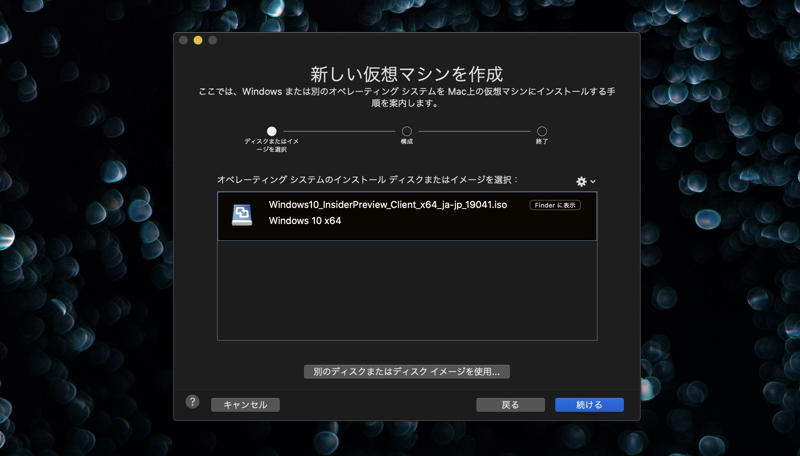
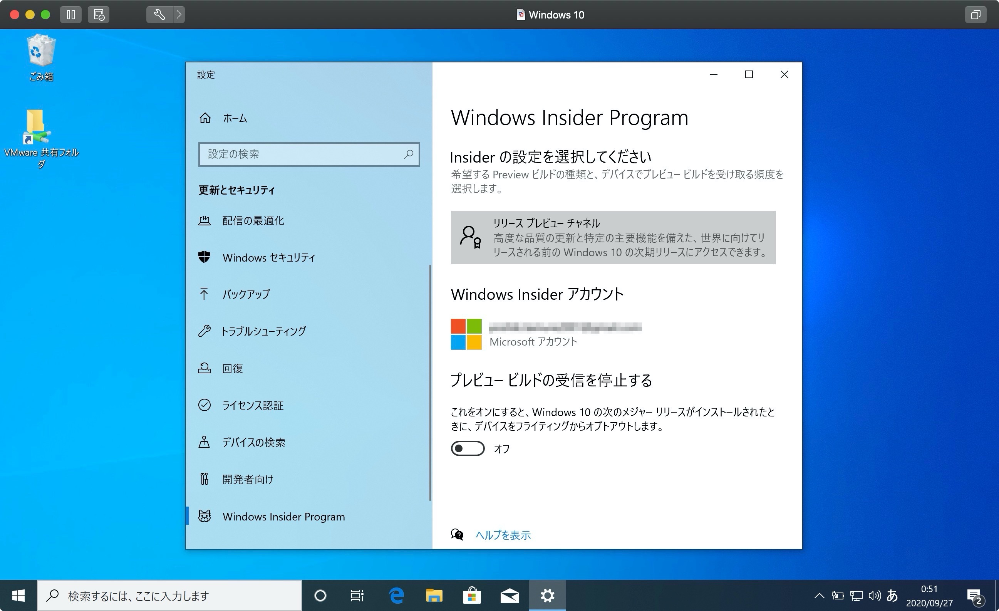
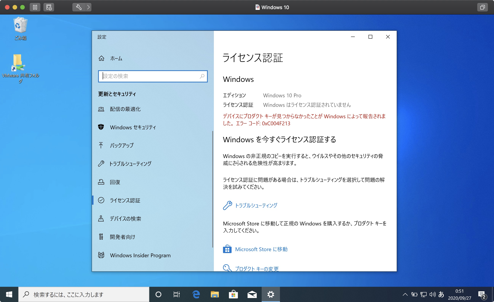
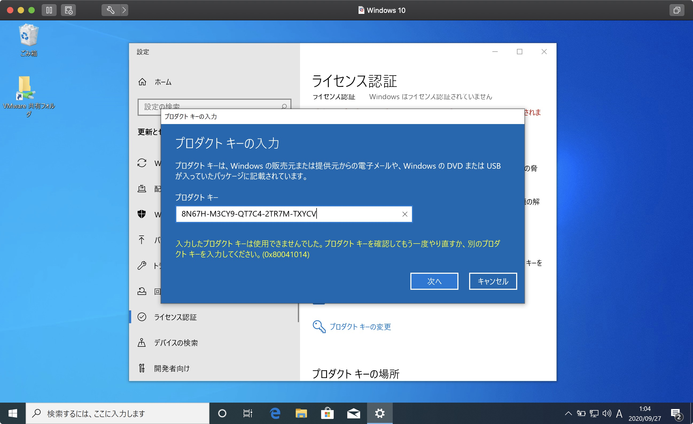



## FusionPlayer & Win10InsiderPreview



まずFusionPlayerとWin10InsiderPreviewの組み合わせを試してみました。


Win10InsiderPreviewは現在新規プロダクトキーを発行していないので、[スキッププロダクトキー](https://answers.microsoft.com/ja-jp/insider/forum/insider_wintp-insider_install/windows-10-insider-preview/86173780-0ffc-4d68-b827-f041e29a2927)を入力してセットアップしました。

```html
Windows10 Home : TX9XD-98N7V-6WMQ6-BX7FG-H8Q99
Windows10 Pro  : VK7JG-NPHTM-C97JM-9MPGT-3V66T
```



Parallels同様、Win10のセットアップなどをせずに非常にスピーディーにインストールでき、設定からInsiderProgramを有効にしました。



しかし、当たり前ながらWin10InsiderPreviewのプロダクトキーがないため利用できません。



調べてみたところ、ビルド10158以降でプロダクトキーの入力を要求される場合には、以下のキーを使えば[いいらしい](https://answers.microsoft.com/ja-jp/insider/forum/insider_wintp-insider_install-insiderplat_pc/windows-10-insider-preview-build-10158/cc273bcc-09d4-4281-bb6a-4b9a0410a5a4)ので使ってみましたが、うまくいきませんでした。

```html
Windows10 InsiderPreview Home       : KTNPV-KTRK4-3RRR8-39X6W-W44T3
Windows10 InsiderPreview Pro        : 8N67H-M3CY9-QT7C4-2TR7M-TXYCV
Windows10 InsiderPreview Enterprise : CKFK9-QNGF2-D34FM-99QX2-8XC4K
```

## FusionPlayer & Win10Education

次に学生だと様々なサービスを無料で利用できちゃう Microsoft Azure for Students（Microsoft Imagineの一部？）

https://signup.azure.com/studentverification

電話番号による確認を終えたら、大学のメールアドレスか確認コードを用いて<b>学生の確認</b>を行います。


大学の契約内容？によってはもらえない[使えない場合](https://tkg5th.hatenablog.com/entry/2019/09/25/000000)もあるみたいです。


ソフトウェアへ移動し`Windows 10 Education`と検索しライセンスを取得します。検索の時、10の前後のスペースがないと引っかかりません。


