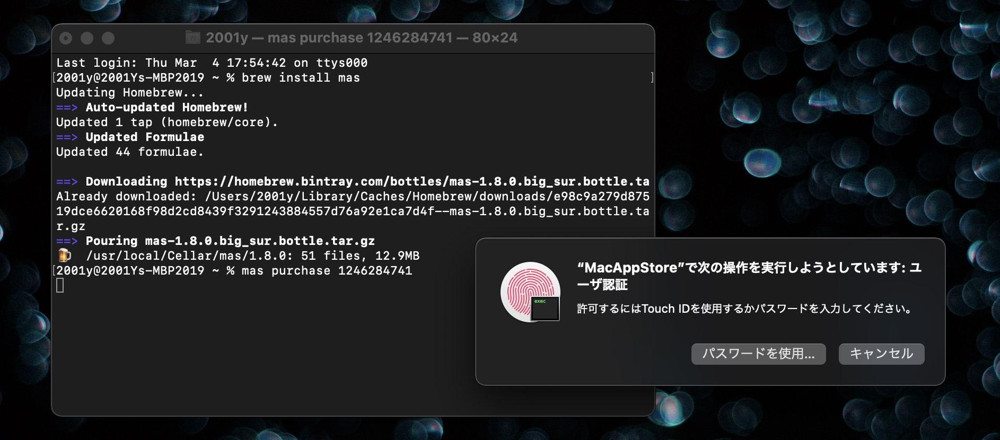
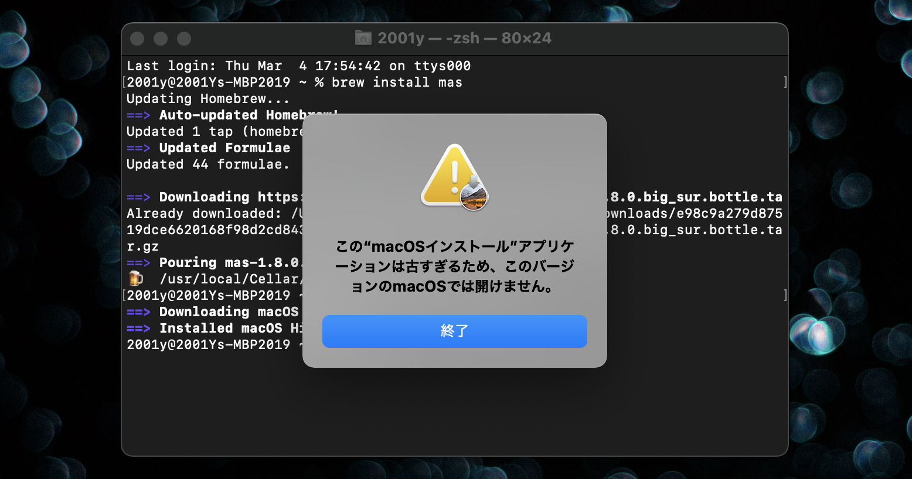



## AppStoreから古いmacOSをダウンロードできない

古いiMac(late2009)がリカバリモードからも再インストールができなくなり、起動ディスクを作るためにmacOS BigSurでmacOS HightSierraをダウンロードしたところ、うまくいかない。


## AppStoreをコマンドラインから操作できるmasを使う

### ターミナルを開く

**Launchpad**か**アプリケーションフォルダ内のユーティリティフォルダ**から、macOSに標準でインストールされている<b>ターミナル</b>というアプリを開きます。よくわからない場合は ⌘ + スペースキー を押してSpotlightで『ターミナル』と検索。


### Homebrewを使ってmasをインストール

AppStoreをコマンドラインから操作できるmasをHomebrewでインストールします。masの詳しい使い方は[公式Github](https://github.com/mas-cli/mas)。

```sh
brew install mas
```

### masで古いmacOSをダウンロード

次に、masを使って古いmacOSをダウンロードします。`mas install`ではなく`mas purchase`でないと動かなそう。

```sh
mas purchase [古いmacOSのID]
```

IDはAppStoreのリンクに書かれているIDを使用します。

```html
macOS High Sierra の例
https://apps.apple.com/jp/app/macos-high-sierra/id1246284741
                                                  ¯¯¯¯¯¯¯¯¯¯
```

最近のいくつかのIDをまとめてみました。

| OS名                                                         | ID         |
| ------------------------------------------------------------ | ---------- |
| [OS X El Capitan 10.11](https://apps.apple.com/app/os-x-el-capitan/id1147835434) | 1147835434 |
| [macOS Sierra 10.12](https://apps.apple.com/jp/app/macos-sierra/id1127487414) | 1127487414 |
| [macOS High Sierra 10.13](https://apps.apple.com/jp/app/macos-high-sierra/id1246284741) | 1246284741 |
| [macOS Mojave 10.14](https://apps.apple.com/jp/app/macos-mojave/id1398502828) | 1398502828 |
| [macOS Catalina 10.15](https://apps.apple.com/jp/app/macos-catalina/id1466841314) | 1466841314 |

***

今回はHigh Sierraをダウンロードしたいので`mas purchase 1246284741`を実行します。



macOSのインストローラーはダウンロードが完了すると自動的にアプリが開くためこのような表示が出ますが、




#### Big Sur

```
sudo /Applications/Install\ macOS\ Big\ Sur.app/Contents/Resources/createinstallmedia --volume /Volumes/MyVolume
```

#### Catalina

```
sudo /Applications/Install\ macOS\ Catalina.app/Contents/Resources/createinstallmedia --volume /Volumes/MyVolume
```

#### Mojave

```
sudo /Applications/Install\ macOS\ Mojave.app/Contents/Resources/createinstallmedia --volume /Volumes/MyVolume
```

#### High Sierra

```
sudo /Applications/Install\ macOS\ High\ Sierra.app/Contents/Resources/createinstallmedia --volume /Volumes/MyVolume
```

#### El Capitan

```
sudo /Applications/Install\ OS\ X\ El\ Capitan.app/Contents/Resources/createinstallmedia --volume /Volumes
```