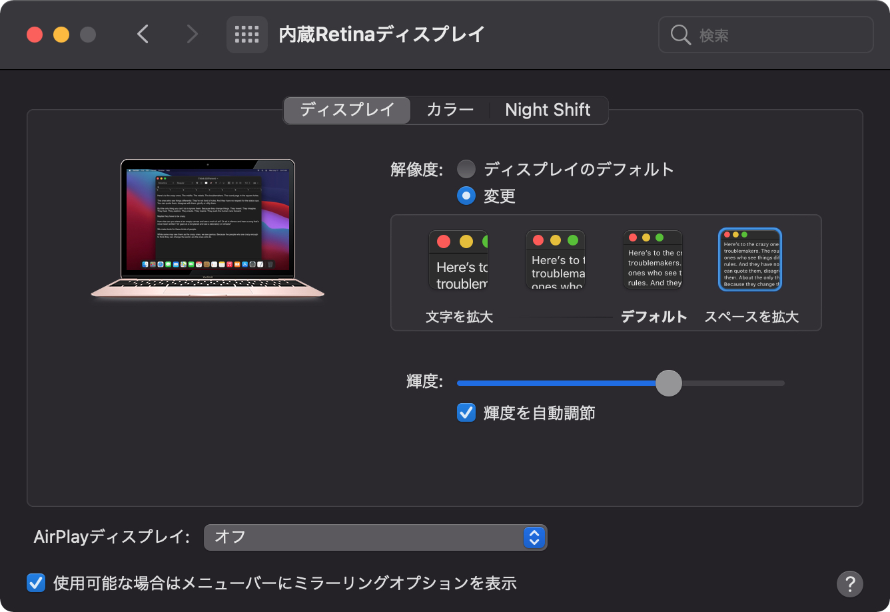



## 　　　　　　　Finderの設定

### 環境設定


### タブバー・パスバーを表示


### 表示オプションの設定


## Dockの設定

### アプリケーションフォルダを追加


### フォルダの表示設定 




## システム環境設定の設定

### トラックパッド：素早く、タップだけで、静かに、クリックできるように

　

### 3本指のドラッグを有効に



### ディスプレイ：解像度を "スペースを拡大" に



### 一般：サイドバーのアイコンサイズを "小" に


### Dockとメニューバー：Dockを自動的に表示/非表示に




## ターミナルでの設定

### Dockの設定

#### アニケーションスピードを0にして高速に表示/非表示

```sh
defaults write com.apple.dock autohide-time-modifier -int 0; killall Dock
```

#### アプリを"非表示"にした時にDockのアイコンを半透明に

```sh
defaults write com.apple.dock showhidden -bool true
```

### スクリーンショットの設定

killall SystemUIServerはSierra以降であれば不要です。

#### 保存形式をjpgに

```sh
defaults write com.apple.screencapture type jpg
```

#### ファイル名の"スクリーンショット"の部分を変更

```sh
defaults write com.apple.screencapture name "Capture"
```

#### ファイル名の日付を非表示に

```sh
defaults write com.apple.screencapture include-date -bool false
```
