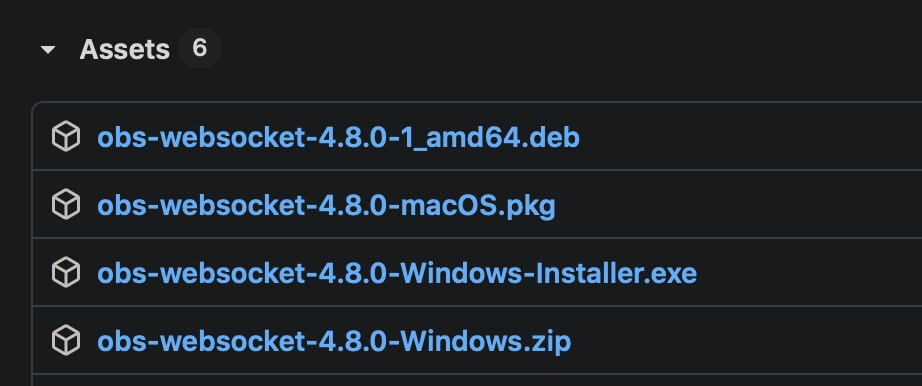
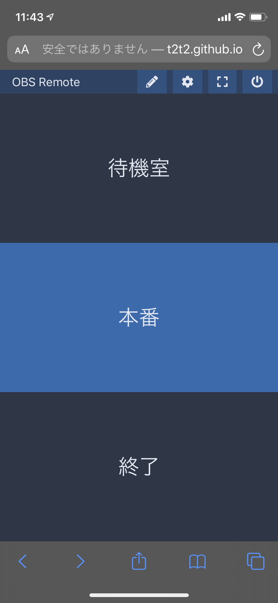



## OBS Remote Tablet

`OBS Remote Tablet`は同じWiFi環境下のOBSを遠隔操作することができるようになるWebサイトです。

### WebSocketプラグインをインストール

`OBS Remote Tablet`はWebSockets経由で操作するため、[Github](https://github.com/Palakis/obs-websocket/releases/)からOSにあった最新のものを`obs-websocket`をインストールする必要があります。

### OBS Remote Tabletから遠隔操作する



同じパソコンでは上記のサイトにアクセスするだけで、

#### スマホ・タブレットから遠隔する

#### httpsでは動作しないので注意

なんとなくhttpが気になってhttpsに書き換えたのですが、`obs-websocket`が対応してないらしくhttpでアクセスする必要がありそう。

***

