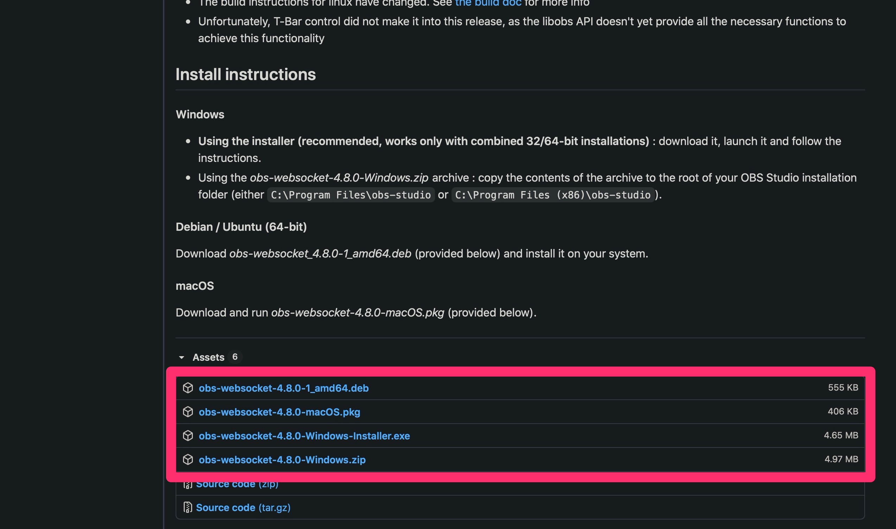
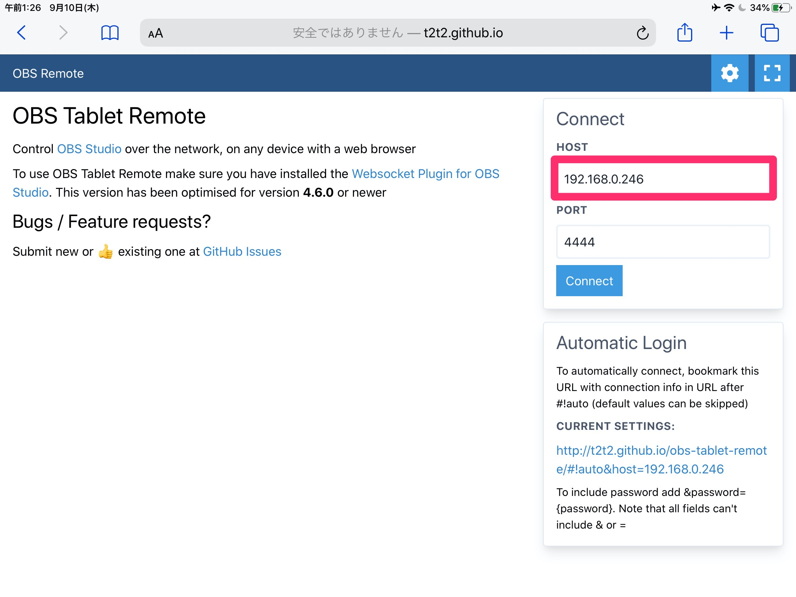

`OBS Remote Tablet`は同じWiFi環境下のOBSを遠隔操作することができるようになるWebサイトです。



## 事前準備：WebSocketプラグインを導入

`OBS Remote Tablet`はWebSockets経由で操作するため、`obs-websocket`をインストールする必要があります。

### ダウンロード

[Githubから](https://github.com/Palakis/obs-websocket/releases/)自分のOSにあったものをダウンロードします。

### インストール

ダウンロードフォルダから、`obs-websocket`をインストールします。

### 確認

OBSを起動し、`obs-websocket`がインストールできてることを確認します。

## スマホ・タブレットから遠隔する

### そのパソコンのIPを取得する

OBSを起動しているパソコンのプライベートIPを取得します。Macの場合は、システム環境設定のネットワーク項目から確認することができます。

### スマホやタブレットからIPを指定して遠隔する

スマホやタブレットから[OBS Remote Tablet](http://t2t2.github.io/obs-tablet-remote/#!auto)にアクセスし、`HOSTの欄`に先ほどのOBSを起動しているパソコンのIPを入力し、接続します。

***

### シーン切り替え以外にも音量の調整など様々な遠隔操作が可能

右上のペンマークから、シーン切り替え以外のボリュームの調整などの操作ができます。

#### httpsでは動作しないので注意

なんとなくhttpが気になってhttpsに書き換えたのですが、`obs-websocket`が対応してないらしくhttpでアクセスする必要がありそう。

***

