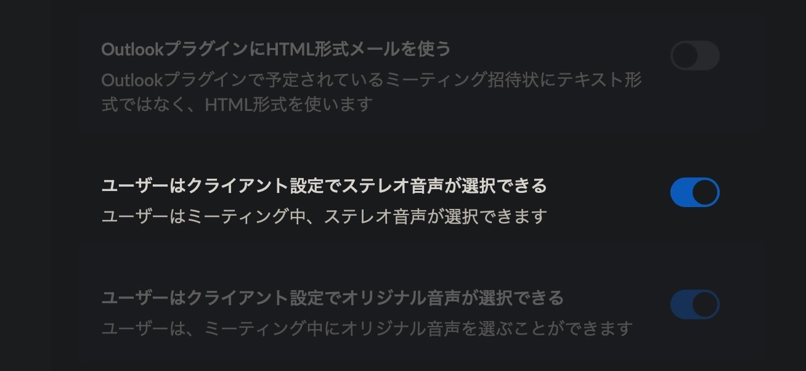



## Zoomには アカウント設定 と クライアント（アプリ）設定 がある。

まず、設定を変える上でZoomには、アプリから設定できるクライアントの設定の他に、Webからアクセスするアカウント自体の設定が存在します。

そのため、アカウント設定で有効にしておかないと、そもそもクライアント設定には表示もされない項目があるようで、ステレオ設定もその1つみたい。

### 1. アカウント設定

なので、まずは[Web上で設定するアカウント自体の設定](https://zoom.us/profile/setting#DefaultClientSendInvite-title)から、ステレオ音声の項目を有効にします。ページ全体の1/4ぐらいの位置かな？

### 2. クライアント設定

次にクライアント、アプリ側の設定を開きステレオを有効にします。

#### これはあくまで

***

