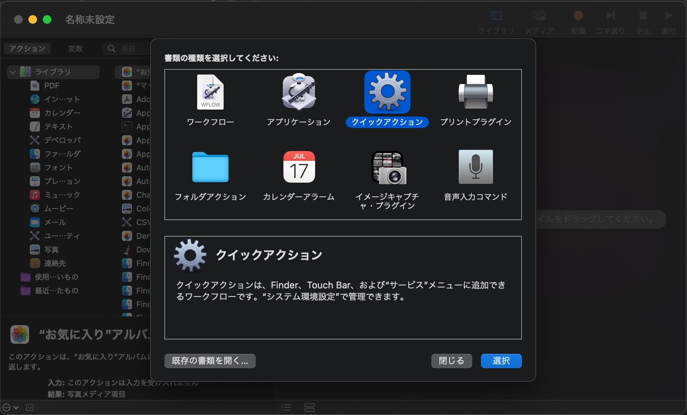

iOS11からiPhoneがHEIFに対応しました。ストレージ節約につながって非常に便利ですが、やはり一般的なのはJPEGやPNG。

LINEなどの別サービスへ転送する際にiOSが自動的にJPEGに変換してくれますが、MacにAirDropなどでシェアするとHEIFのまま共有されます。

[アプリを使えば](https://apps.apple.com/jp/app/imazing-heic-converter/id1292198261?mt=12)簡単にHEIFからJPEGに変換することはできますが、今回はFinder上で右クリックからJPEGに変換するクイックアクションを作りたいと思います。



## Automatorでクイックアクションを作成

**Launchpad**か**アプリケーションフォルダ**から、macOSに標準でインストールされている<b>Automator</b>というアプリを開きます。

Automatorで<b>クイックアクションを新規作成</b>します。

## フォルダの検出を /Volumes に指定

右上から監視するフォルダを指定します。

フォルダ選択ウィンドウが表示されたら、

<b>/ (スラッシュ)キーを押すことでパスからフォルダを指定することができる</b>ので、`/Volumes`を入力します。

移動を確認したら確定。

`Volumesフォルダ`が監視対象になっていることを確認したら準備完了。

## あとは普通にワークフローを作成する

画像はMacにドライブを接続した際に通知するワークフローです。

