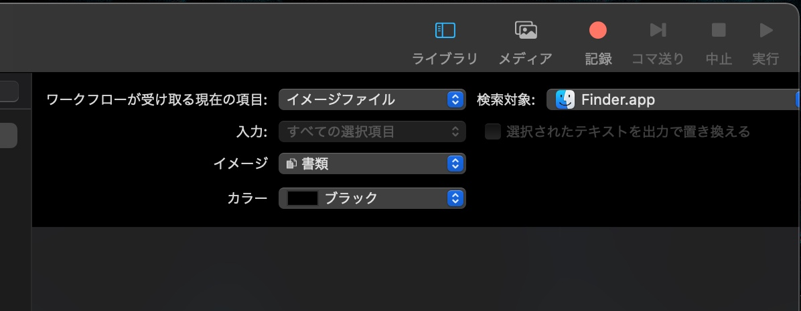

iOS11からiPhoneがHEIFに対応しました。ストレージ節約につながって非常に便利ですが、やはり一般的なのはJPEGやPNG。

LINEなどの別サービスへ転送する際にiOSが自動的にJPEGに変換してくれますが、MacにAirDropなどでシェアするとHEIFのまま共有されます。

[アプリを使えば](https://apps.apple.com/jp/app/imazing-heic-converter/id1292198261?mt=12)簡単にHEIFからJPEGに変換することはできますが、今回は<b>Finder上で右クリックからJPEGに変換するクイックアクション</b>を作りたいと思います。



## Automatorでクイックアクションを作成

**Launchpad**か**アプリケーションフォルダ**から、macOSに標準でインストールされている<b>Automator</b>というアプリを開きます。

Automatorで<b>クイックアクションを新規作成</b>します。

## クイックアクションの詳細を設定

ウィンドウ右上から任意の設定に変更します。

今回の受け取る項目を<b>イメージファイル</b>。検索対象を<b>Finder.app</b>にします。イメージは右クリックした時に出したい好きなアイコンを選択。

## あとは普通にワークフローを作成する

画像はMacにドライブを接続した際に通知するワークフローです。

