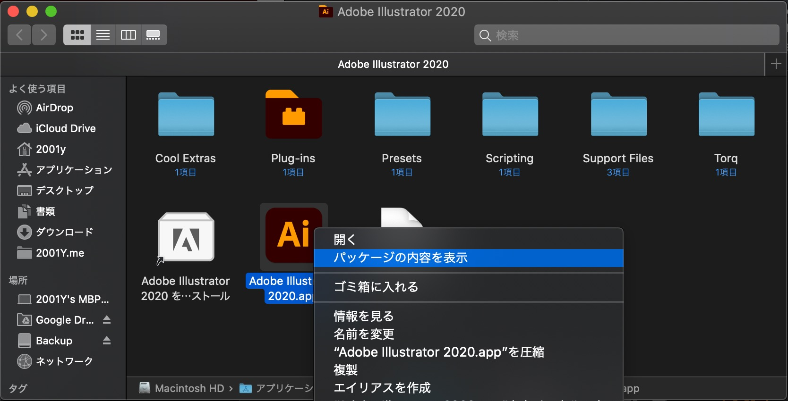
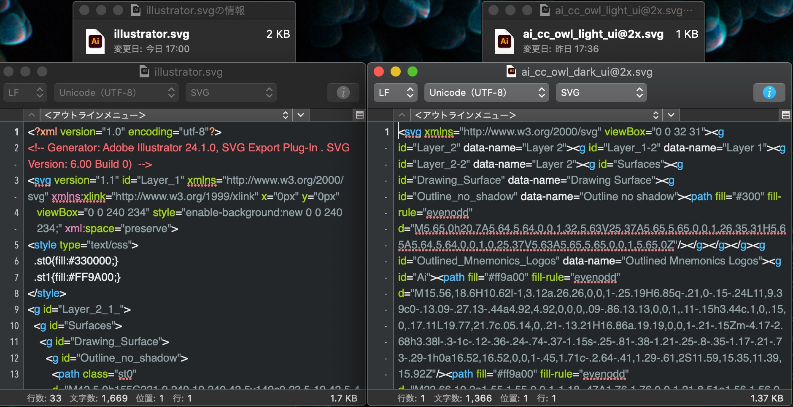

Adobeのロゴが一新されて、枠が取れたり、角が丸くなったり、シンプルになったみたい。まず、ベクターデータが欲しくなる。

## イラレから取得する



Macのアプリは.appの **パッケージの内容を表示** でアプリに使われているファイルがたくさん見えるので、そこからsvgをゲットする方法。

```sh
/Applications/Adobe Illustrator 2020/Adobe Illustrator.app/Contents/Resources/ai_cc_owl_dark_ui@2x.svg
```

```sh
/Applications/Adobe Illustrator 2020/Adobe Illustrator.app/Contents/Resources/ai_cc_owl_light_ui@2x.svg
```

## Adobeサイトから取得する

Webからsvgを持ってくる。僕は[イラレの個別サイト](https://www.adobe.com/jp/products/illustrator.html)からとってみるとここみたい。この方法だとイラレを持ってない人でもできる。

```html
https://www.adobe.com/content/dam/cc/icons/illustrator.svg
```

### データの違い



イラレでパスを見た感じ大きな違いはないけど、viewBoxのサイズが違ったり、イラレ からの取得の方が小さくなってるみたい。

