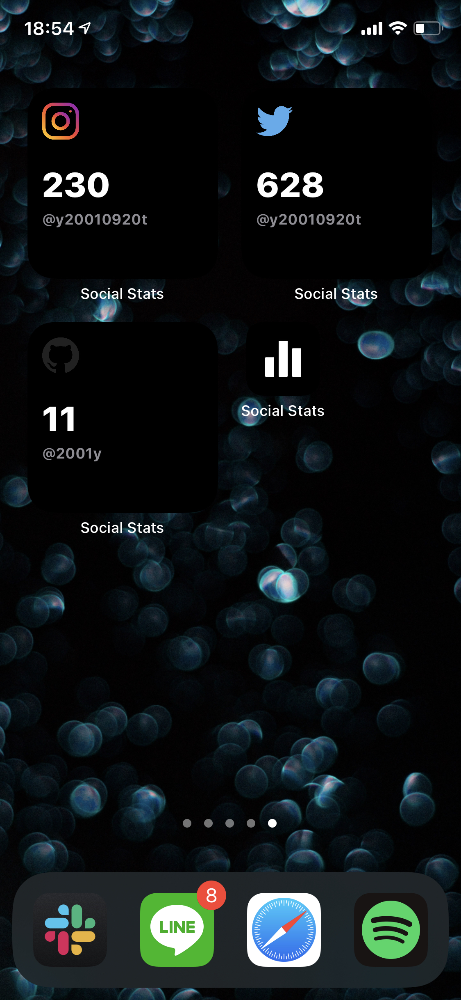

iOS14からホーム画面にウィジェットを追加する機能が追加されました。Twitterではショートカットを使ってアイコンを変更して[こだわりのホーム画面を作る](https://iphone-mania.jp/news-315424/)のが流行りましたが、やはりまだ対応したアプリが多くない。

SNSのフォロワー数をシンプルかつおしゃれに表示する<b>SocialStatsWidget</b>というウィジェットアプリを見つけて、日本の記事が見当たらなったので残しておきます。

## SocialStatsWidget｜無料

＞[AppStore](https://apps.apple.com/jp/app/social-stats-widget/id1533776006) 

ウィジェットは2x2の小さいタイプのみ。ウィジェットをホーム画面に追加してから、アカウントを指定します。

現時点では Twitter, Instagram, Github, Reddit, Medium, Telegram, Unsplash に対応しています。ただ、120円の課金要素がありInstagramは課金対象でした。

ID指定のみなので、著名人などのログイン情報がわからないユーザーのフォロワー数を表示することも可能です。また、複数アカウントにも対応しています。

