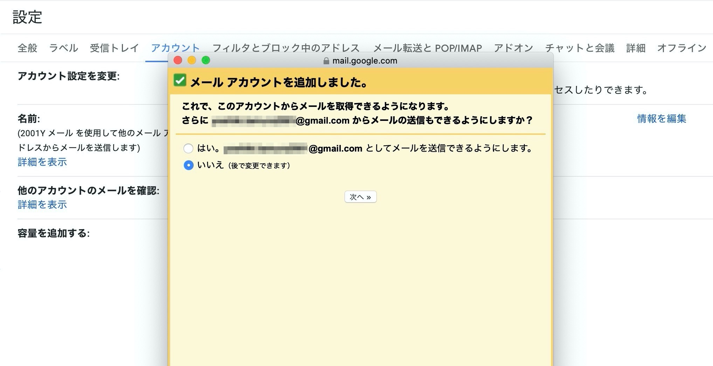

Googleの空き容量がなくなってしまったみたいで、折角[GSuiteで容量無制限](https://2001y.me/blog/gadget/gsuite-unlimit/)なのにメールを消去するのももったいないので、全てGSuiteのGmailに転送してみました。

わかりにくくなるので、転送元はブラック背景、転送先はホワイト背景です。

## 転送"元"のGmailで設定

### すべてをPOPダウンロードするように指定

転送元の[Gmail設定のメール転送とPOP/IMAP](https://mail.google.com/mail/u/0/?tab=wm#settings/fwdandpop)を開き、POPダウンロードの<b>すべてのメール</b>にチェックを入れる。保存はページの一番下にあるので忘れないように保存する。

## 転送"先"のGmailの設定

転送先の[Gmail設定のアカウント](https://mail.google.com/mail/u/1/#settings/accounts)を開き、<b>メールアカウントを追加する</b>。

<b>転送"元"のメールアドレス</b>を入力し、次へ。

<b>転送"元"Googleアカウントのパスワード</b>を入力して、アカウントを追加。2段階認証が有効な場合はアプリパスワードを使用します。（手順は後記の通り）

メール送信は別にしなくて良いので、これで設定完了です。

### 2段階認証をつけている場合：アプリパスワードを取得する

転送元Googleアカウントのパスワードを入力しても以下のようなエラーが出る場合は、二段階認証が有効になっています。その場合はGoogleアカウントのパスワードではなく、アプリパスワードを指定する必要があります。

![指定のユーザー名とパスワードによるPOP3アクセスはサーバーで拒否されました。サーバーから返されたエラー: "[AUTH] Application-specific password required: https://support.google.com/accounts/answer/185833"](../../../images/gmail-alltransfer-5.jpg)

<b>転送"元"Googleアカウント</b>のセキュリティ設定の[アプリパスワード](https://myaccount.google.com/apppasswords)を開き新しいアプリパスワードを作成します。

***

設定を終えて転送先の[Gmail設定のアカウント](https://mail.google.com/mail/u/1/#settings/accounts)を確認すると転送を行なっていることがわかります。200通づつにわけて受信するみたいです。

▶︎ [How to Transfer Emails from One Gmail Account to Another｜YouTube](https://www.youtube.com/watch?v=yyhb6Rl_2BY)