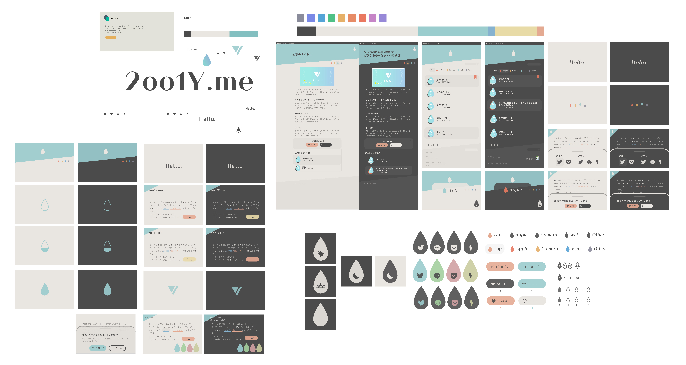

はじめまして！2001Yです。

前回は、Pjaxに憧れを持ち新しいブログを始めたのですが、「はじまり」という記事を一つ作って、それから更新することなく新しいブログを作りたくなってしまいました。

あまりにもひどいので、少し振り返ってみました。

## ブログというより(Web)デザインが好きだった...？

一つの記事も書けないのに、なぜまた新しいブログを作ろうと思うのか...

今回のブログデザインはIllustratorでデザインしてから、コーディングに取り掛かりました。本当はSkech、XDの方が良いだと思うのですが、慣れていたIllustratorで作成してしまいました。（でも、いつか始めないと始める機会がなくなってしまう...汗）

記事を書くより、デザインやコーディングをしてるときの方が楽しい...

記事を書くたびに新しい要素、機能を追加してしまって、記事が完成せずに書くことに飽きてしまう。だから、WordPressで既存のテーマで作業していた時が一番、記事が多かったのかも...

## それでも、ブログという形のサイトを作りたい

続かないブログをなぜ作るのか自分の言い訳を作ってみたいと思います。

### 作りたい“普通のサイト”がない

1人でできる普通のサイトを考えると、Webサービス、架空のホームページ、ポートフォリオなど。

Webサービスはサーバー要求が高かったりと、維持も大変。架空のホームページはできますが、せっかく作るなら意味のあるものが作りたい。そうすると、自分のメモとしも、ブログかなぁ。

ポートフォリオは作る予定...（特に載せるものもないけど）

### 実は文章書くのが嫌いじゃない？

ずっと文章を書くのは嫌いだったはずなのですが、意外と少し好きな気がして、それを知るためにも文章を書いてみよう！となりました。

ということもあって、出来るだけ文章メインのデザインになるように頑張ってみたけど...まず文章が上手くならないと...汗

### そもそも始まりがブログ...

Webデザインにハマったのは既存のBloggerのテーマが気に入らずにいじり始めたのが始め。WordPressに憧れて試したり、いろいろしてきたけど、ずっとブログしか作ってきてない！！

それなら、やっぱり、ブログを作るべきなのかな...と笑

何か別のものを作るときも、苦労したところなんかをまとめておくと、人の役に立つ以前に自分が忘れた時に役に立ちます。なので、自分で見返すノートを作るような感覚で、使っていこうかなと考えています。

## どんなブログにしていくか

調べて自分が苦労したことをまとめていこうかな。

物覚えが悪いのでなんでも調べ直すことばかり。自分の手でまとめることで、少しでも覚えられるようになると嬉しい！

あとは、自分がやってみたいことを実装していく、自分の中のプラットホームになればベストかな...

## さいごに

もっと、作る時にこだわったところとかもまとめようと思ったけど、全然まとめられない気がして...後々まとめていければいいかな。YouTubeBGMとかまだまだ試してみたいこともあるし...！

今回は結構頑張って作ったし、長続きさせたい。頼む。