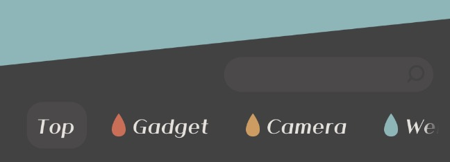
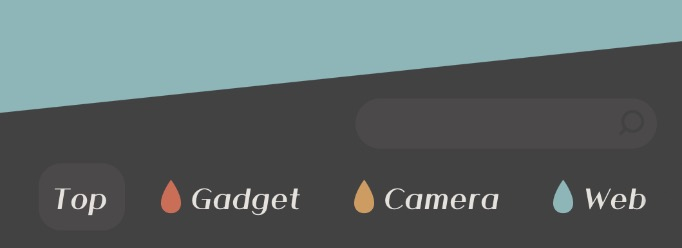

このブログのリストページはカテゴリを4色に分類して横に並べたナビがあります。


スマートフォンなどでは横幅が足りないため横スクロールさせていて、スクロール可能なことをグラデーションで表現していました。



しかし、解像度が合うと3つしかカテゴリがないように見えることに気づいたので、バウンドアニメーションを[取り入れました](https://2001y.me/blog)。



## 横スクロールを促すアニメーション

<iframe height=170px class=codepen src="https://mineditor.github.io/?h=%253Cdiv%2520class%3Dtarget%253E%250A%2520%2520%253Cspan%253E%253C%2Fspan%253E%250A%2520%2520%253Cspan%253E%253C%2Fspan%253E%250A%2520%2520%253Cspan%253E%253C%2Fspan%253E%250A%2520%2520%253Cspan%253E%253C%2Fspan%253E%250A%2520%2520%253Cspan%253E%253C%2Fspan%253E%250A%253C%2Fdiv%253E%250A%253Cbutton%2520onclick%3D%2522window.location.reload%28%29%3B%2522%253EReload%253C%2Fbutton%253E&c=.target%2520%257B%250A%2520%2520animation%3A%2520bound%2520.5s%2520forwards%3B%250A%257D%250A%40keyframes%2520bound%2520%257B%250A%2520%25200%2525%2520%257B%250A%2520%2520%2520%2520margin-left%3A%25200%3B%250A%2520%2520%257D%250A%2520%252050%2525%2520%257B%250A%2520%2520%2520%2520margin-left%3A%2520-10vw%3B%250A%2520%2520%257D%250A%2520%2520100%2525%2520%257B%250A%2520%2520%2520%2520margin-left%3A%25200%3B%250A%2520%2520%257D%250A%257D%250A%250A%250A.target%2520%257B%250A%2520%2520height%3A%252030vh%3B%250A%2520%2520overflow%3A%2520scroll%3B%250A%2520%2520display%3A%2520flex%3B%250A%257D%250Abody%2Csection%2520%257B%250A%2520%2520display%3A%2520flex%3B%250A%2520%2520flex-direction%3A%2520column%3B%250A%2520%2520justify-content%3A%2520center%3B%250A%257D%250Aspan%2520%257B%250A%2520%2520min-width%3A%252030vw%3B%250A%2520%2520min-height%3A%25203vh%3B%250A%2520%2520background%3A%2520skyblue%3B%250A%2520%2520margin-right%3A%25201vw%3B%250A%257D%250A%250Abutton%2520%257B%250A%2520%2520padding%3A%252010px%3B%250A%2520%2520position%3A%2520fixed%3B%250A%2520%2520bottom%3A%252020px%3B%250A%2520%2520right%3A%252020px%3B%250A%257D&j="></iframe>

`Reload`するとわかりますが、アクセス時に左側にスライドしたようなアニメーションで、`margin-left`をマイナスに振ってます。

```css
.target {
  animation: bound .5s forwards;
}
@keyframes bound {
  0% {
    margin-left: 0;
  }
  50% {
    margin-left: -10vh; //左へ移動
  }
  100% {
    margin-left: 0; //元に戻す
  }
}
```

## 縦スクロールを促すアニメーション

<iframe height=170px class=codepen src="https://mineditor.github.io/?h=%253Cbody%253E%250A%2520%2520%253Ch1%253E%25E3%2582%25BF%25E3%2582%25A4%25E3%2583%2588%25E3%2583%25AB%253C%2Fh1%253E%250A%2520%2520%253Cp%253E%25E3%2583%2586%25E3%2582%25AD%25E3%2582%25B9%25E3%2583%2588%25E3%2583%2586%25E3%2582%25AD%25E3%2582%25B9%25E3%2583%2588%25E3%2583%2586%25E3%2582%25AD%25E3%2582%25B9%25E3%2583%2588%25E3%2583%2586%25E3%2582%25AD%25E3%2582%25B9%25E3%2583%2588%25E3%2583%2586%25E3%2582%25AD%25E3%2582%25B9%25E3%2583%2588%25E3%2583%2586%25E3%2582%25AD%25E3%2582%25B9%25E3%2583%2588%25E3%2583%2586%25E3%2582%25AD%25E3%2582%25B9%25E3%2583%2588%25E3%2583%2586%25E3%2582%25AD%25E3%2582%25B9%25E3%2583%2588%25E3%2583%2586%25E3%2582%25AD%25E3%2582%25B9%25E3%2583%2588%25E3%2583%2586%25E3%2582%25AD%25E3%2582%25B9%25E3%2583%2588%25E3%2583%2586%25E3%2582%25AD%25E3%2582%25B9%25E3%2583%2588%25E3%2583%2586%25E3%2582%25AD%25E3%2582%25B9%25E3%2583%2588%25E3%2583%2586%25E3%2582%25AD%25E3%2582%25B9%25E3%2583%2588%25E3%2583%2586%25E3%2582%25AD%25E3%2582%25B9%25E3%2583%2588%25E3%2583%2586%25E3%2582%25AD%25E3%2582%25B9%25E3%2583%2588%25E3%2583%2586%25E3%2582%25AD%25E3%2582%25B9%25E3%2583%2588%25E3%2583%2586%25E3%2582%25AD%25E3%2582%25B9%25E3%2583%2588%25E3%2583%2586%25E3%2582%25AD%25E3%2582%25B9%25E3%2583%2588%25E3%2583%2586%25E3%2582%25AD%25E3%2582%25B9%25E3%2583%2588%25E3%2583%2586%25E3%2582%25AD%25E3%2582%25B9%25E3%2583%2588%253C%2Fp%253E%250A%2520%2520%253Cbutton%2520onclick%3D%2522window.location.reload%28%29%3B%2522%253EReload%253C%2Fbutton%253E%250A%253C%2Fbody%253E&c=body%2520%257B%250A%2520%2520animation%3A%2520bound%2520.5s%2520forwards%3B%250A%257D%250A%40keyframes%2520bound%2520%257B%250A%2520%25200%2525%2520%257B%250A%2520%2520%2520%2520margin-top%3A%25200%3B%250A%2520%2520%257D%250A%2520%252050%2525%2520%257B%250A%2520%2520%2520%2520margin-top%3A%2520-10vh%3B%250A%2520%2520%257D%250A%2520%2520100%2525%2520%257B%250A%2520%2520%2520%2520margin-top%3A%25200%3B%250A%2520%2520%257D%250A%257D%250A%250A%250Abutton%2520%257B%250A%2520%2520padding%3A%252010px%3B%250A%2520%2520position%3A%2520fixed%3B%250A%2520%2520bottom%3A%252020px%3B%250A%2520%2520right%3A%252020px%3B%250A%257D&j="></iframe>

縦スクロールはbodyがメインになることが多いと思うのでこれで良さそう。でも、縦スクロールは一般化してるので、使う場面は少なそう。

```css
body {
  animation: bound .5s forwards;
}
@keyframes bound {
  0% {
    margin-top: 0;
  }
  50% {
    margin-top: -10vh; //上へ移動
  }
  100% {
    margin-top: 0; //元に戻す
  }
}
```

***

今回は`margin`で動きをつけてるので、`overflow: scroll;`を指定した親要素ではなく、スクロールする要素を指定してあげる必要があります。

親要素に指定するためには、paddingで指定することもできますが、paddingはマイナスの指定ができないので、逆の動きにすることになります。

試しにデモを載せてみたけど、どちらでも動きがあるだけで注目はしてもらえる気がする。

<iframe height=170px class=codepen src="https://mineditor.github.io/?h=%253Cdiv%2520class%3Dtarget%253E%250A%2520%2520%253Cspan%253E%253C%2Fspan%253E%250A%2520%2520%253Cspan%253E%253C%2Fspan%253E%250A%2520%2520%253Cspan%253E%253C%2Fspan%253E%250A%2520%2520%253Cspan%253E%253C%2Fspan%253E%250A%2520%2520%253Cspan%253E%253C%2Fspan%253E%250A%253C%2Fdiv%253E%250A%253Cbutton%2520onclick%3D%2522window.location.reload%28%29%3B%2522%253EReload%253C%2Fbutton%253E&c=.target%2520%257B%250A%2520%2520animation%3A%2520bound%2520.5s%2520forwards%3B%250A%257D%250A%40keyframes%2520bound%2520%257B%250A%2520%25200%2525%2520%257B%250A%2520%2520%2520%2520padding-left%3A%25200%3B%250A%2520%2520%257D%250A%2520%252050%2525%2520%257B%250A%2520%2520%2520%2520padding-left%3A%252010vw%3B%250A%2520%2520%257D%250A%2520%2520100%2525%2520%257B%250A%2520%2520%2520%2520padding-left%3A%25200%3B%250A%2520%2520%257D%250A%257D%250A%250A%250A.target%2520%257B%250A%2520%2520height%3A%252030vh%3B%250A%2520%2520overflow%3A%2520scroll%3B%250A%2520%2520display%3A%2520flex%3B%250A%257D%250Abody%2Csection%2520%257B%250A%2520%2520display%3A%2520flex%3B%250A%2520%2520flex-direction%3A%2520column%3B%250A%2520%2520justify-content%3A%2520center%3B%250A%257D%250Aspan%2520%257B%250A%2520%2520min-width%3A%252030vw%3B%250A%2520%2520min-height%3A%25203vh%3B%250A%2520%2520background%3A%2520skyblue%3B%250A%2520%2520margin-right%3A%25201vw%3B%250A%257D%250A%250Abutton%2520%257B%250A%2520%2520padding%3A%252010px%3B%250A%2520%2520position%3A%2520fixed%3B%250A%2520%2520bottom%3A%252020px%3B%250A%2520%2520right%3A%252020px%3B%250A%257D&j="></iframe>

***

というか、今更だけどパフォーマンスを考えると`transform`で指定してあげたほうがいい気がする。