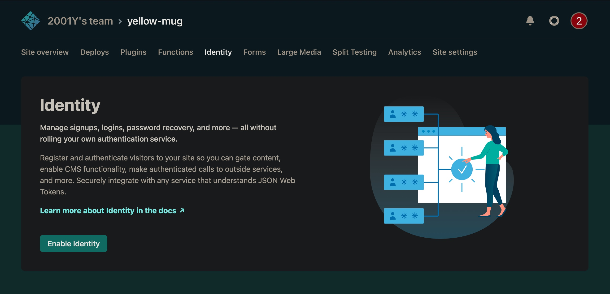
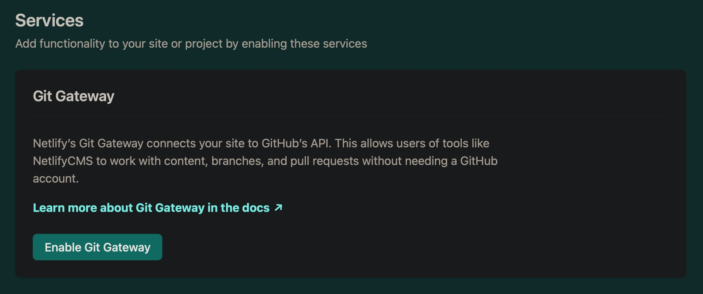

久しぶりに新しいサイトにNetlifyCMSを導入した時に少し躓いたのでメモ。

## Netlify Identity

### エラー

```html
Unable to access identity settings. When using git-gateway backend make sure to enable Identity service and Git Gateway.
```


### 解決法




## Git Gateway

### エラー

```html
Your Git Gateway backend is not returning valid settings. Please make sure it is enabled.
```


### 解決法



***

あと、githubのブランチのデフォルトが`main`になったので

config.toml

```yaml
backend:
  name: git-gateway
  branch: master
```