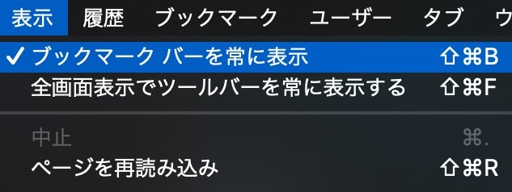

## ブックマークバーにドラッグ&ドロップする

### ブックマークバーを表示する方法

Chromeは[Safariと違い](https://2001y.me/blog/web/bookmarklet-mac-safari/#ブックマークバーお気に入りバーを表示する方法)、ブックマークが全て表示されるためブックマークレットフォルダなどを作った方が良いかもしれません。

***

Safariをメインに使っているとChromeの無駄な余白になれなくて、Vivaldi使おうとしていた時期もあります。でもやっぱり、Chromiumの中ではChromeがメインになりがちです。
