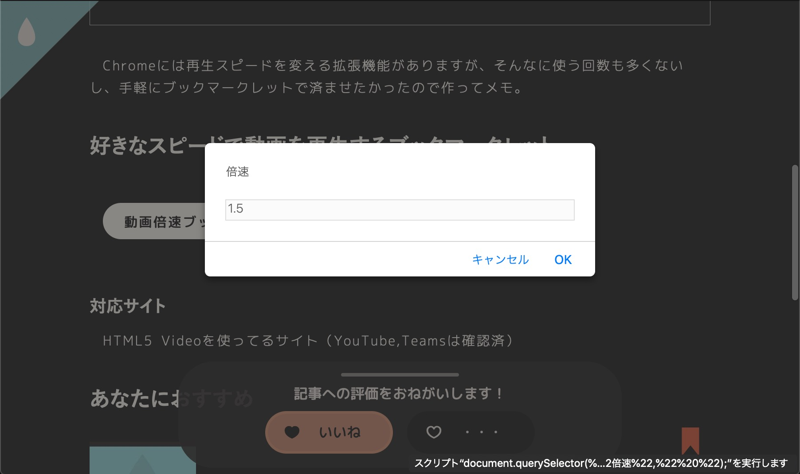

Chromeには再生スピードを変える拡張機能がありますが、そんなに使う回数も多くないし、手軽にブックマークレットで済ませたかったので作ってメモ。



## 好きなスピードで動画を再生するブックマークレット

<p class=noIndent>
  <a href="javascript:document.querySelector(%22video%22).playbackRate=window.prompt(%22倍速%22,%22 %22);" class=download>動画倍速ブックマークレット</a>
</p>


### 対応サイト

HTML5 Videoを使ってるサイト（YouTube,Teamsは確認済）

### ブックマークレットの登録方法

ブックマークバーに上のボタンを**ドラッグ&ドロップ**、詳しくは以下を参考に。

<p class="noIndent"><a href="https://2001y.me/blog/web/bookmarklet-chrome" target="_blank" rel="noopener noreferrer">Chromeをお使いの方</a>・<a href="https://2001y.me/blog/web/bookmarklet-mac-safari" target="_blank" rel="noopener noreferrer">Safari(Mac)をお使いの方</a>・<a href="https://2001y.me/blog/web/bookmarklet-ios-safari" target="_blank" rel="noopener noreferrer">Safari(iOS)をお使いの方</a></p>



## 使い方

倍速などの文字は不要で数字だけ入力すればok。



## 仕組み

```js
javascript:document.querySelector("video").playbackRate=window.prompt("倍速"," ");
```