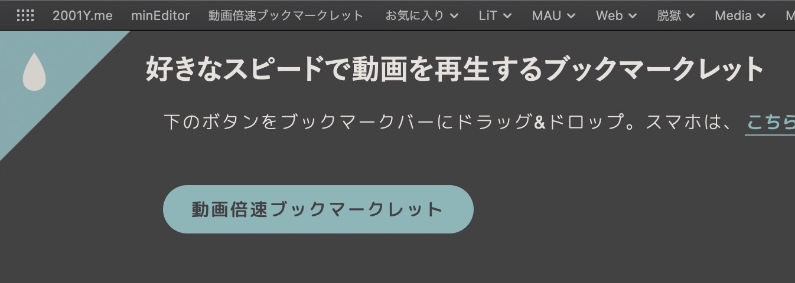
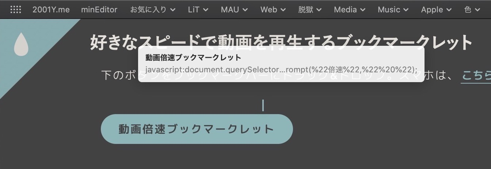
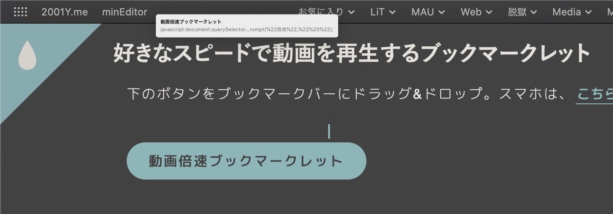
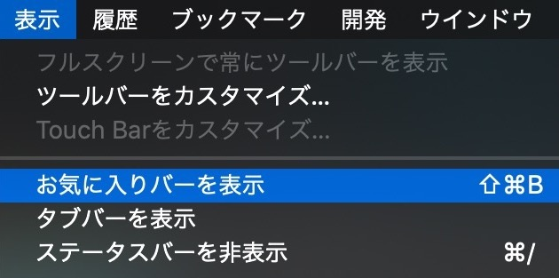

## ブックマークバー（お気に入りバー）にドラッグ&ドロップする

### ブックマークバー（お気に入りバー）を表示する方法

お気に入りバーはブックマークの`お気に入り`を表示しています。`お気に入り`に追加する必要もありませんが、アクセスがいいので`お気に入り`に登録しておくと便利。

***

ChromeなどのChromiumベースのブラウザはバグの修正なども早く、クロスプラットフォームに対応しているため便利ですが、バッテリー消費量やメモリ使用量が激しいのも事実。

iOSでもSafariをメインで使っているので同期などを考えると、を考えると結果的にいつもSafariに戻ってしまいます。。。