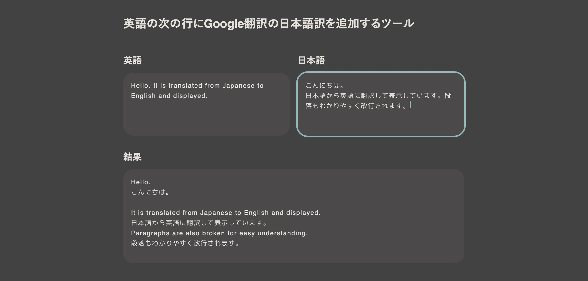

英語の課題をするときに、英文の下に日本語訳を手動で組み直すのがめんどくさいなというところから、英文と和文を交互に並び替えるツールを作りました。



でも、せっかく自動化したんだから、<b>そもそもGoogle翻訳にかければよくない...？</b>そんな悪魔の囁きから作ってしまいました。本当はDeepLでやりたかったけど、お金かかるのでやめました。



## 英語の次の行にGoogle翻訳の日本語訳を追加するツール

<div id=textarea-flex>
  <div>
    <h3>英語</h3>
		<textarea id=enInput oninput="en();" placeholder="Hello. This is Demo." autofocus></textarea>
  </div>
  <div>
    <h3>日本語</h3>
		<textarea id=jaInput oninput="ja();" placeholder="こんにちは。これはデモです。"></textarea>
  </div>
</div>


### 結果

<textarea id="outputInput" readonly>
Hello.
こんにちは。
This is Demo.
これはデモです。
</textarea>


## 主な仕様

### 1. Google翻訳を使用

翻訳にはGoogle翻訳を使用。正確には、API上限回避のために[Google Apps Script の LanguageApp クラスを使用](https://qiita.com/tanabee/items/c79c5c28ba0537112922)。Google翻訳本家とはたまに少し違うこともあるみたい？

### 2. 文は ピリオド（.） と 句点（。） で識別

交互に並べ替える上で、 `.` と `。` で区切って文を識別させた。

### 3. 段落は 改行 で識別

<b>段落を識別するためには、改行を用いた</b>。1回の改行で段落切り替えと認識するため、1文づつ1回改行しているような文章にはあまり向かない。

### 4. 翻訳結果の改行はなくなる

Google翻訳の性質上、翻訳のみの表示では改行がなくなる。

### 5. 文の前後の無駄な余白は消去

文の前後にスペースがある場合は消去される。これがないと英文はピリオド後に半角スペースがあることが多いため、英文の頭がガタガタになる。



## 使い方

### 日本語から英語へ






## コード

```js
let base = "https://script.google.com/macros/s/AKfycbx0APNv1zQVNPP_7HhCl5C_OPiDtCtCl0QhtLVZQmDLWfF-7Ln2/exec?", enTimer, jaTimer, enI, jaI, output;

//oninputで毎回翻訳をかけると重くなるので500msで間引き
function en() {
  if (enTimer) { clearTimeout(enTimer); }
  enTimer = setTimeout(enF(), 500);
}
function ja() {
  if (jaTimer) { clearTimeout(jaTimer); }
  jaTimer = setTimeout(jaF(), 500);
}

//英語 → 日本語
function enF() {
  enT = enInput.value;  //入力した英文を取得
  url = base + "source=en&target=ja&text=" + enT;

  fetch(url).then(function(resp) {  //入力した英文とパラメータをつけてfetch
    return resp.json();
  })
  .then(function (json) {
    jaT = json.text;
    jaInput.value = jaT;  //ひとまず翻訳結果を表示

    let enL = enT.split("."),  //入力した英文をピリオドで区切り配列化
        jaL = jaT.split("。"),  //翻訳結果の和文を句点で区切り配列化
        out = "";
    
    for (let i = 0; i < enL.length; i++) {  //以下の処理を英文の数だけ繰り返す
      let enLi = enL[i];
      if (enLi.includes("\n")) {
        //IF：文内に改行がある場合、trim()しつつ、英文の前に改行を1つ多く追加して段落を強調して整形
        out = out + "\n" + enLi.trim() + ".\n" + jaL[i].trim() + "。\n";
      } else { 
        //ELSE：文内に改行がない場合、trim()で前後の無駄なスペースを省きつつ整形
        out = out + enLi.trim() + ".\n" + jaL[i].trim() + "。\n";
      }
    }
    //出力：途中過程でできた余分な部分を消去して、"結果"に出力
    outputInput.value = out.slice(0, -4);
  })
}

//日本語 → 英語
//逆の処理をするだけ。別々にせずに作りたかったけど、実行ボタンなしで実装するために別々にした。（もっといい方法があるかも）
function jaF() {
  jaT = jaInput.value;
  url = base + "source=ja&target=en&text=" + jaT;

  fetch(url).then(function(resp) {
    return resp.json();
  })
  .then(function (json) {
    enT = json.text;
    enInput.value = enT;

    let enL = enT.split("."),
        jaL = jaT.split("。"),
        out = "";
    
    for (let i = 0; i < jaL.length; i++) {
      let jaLi = jaL[i];
      if (jaLi.includes("\n")) {
        out = out + "\n" + enL[i].trim() + ".\n" + jaLi.trim() + "。\n";
      } else {
        out = out + enL[i].trim() + ".\n" + jaLi.trim() + "。\n";
      }
    }
    outputInput.value = out.slice(0, -4);
  })
}

//.trimのポリフィル　なぜかSafariだとエラーが出たので追加。
if (!String.prototype.trim) {
  String.prototype.trim = function () {
    return this.replace(/^[\s\uFEFF\xA0]+|[\s\uFEFF\xA0]+$/g, '');
  };
}
```

***

`placeholder`内で改行できないの辛い。あと、`.trim()`便利。これに翻訳まで内臓しちゃおうかな...。